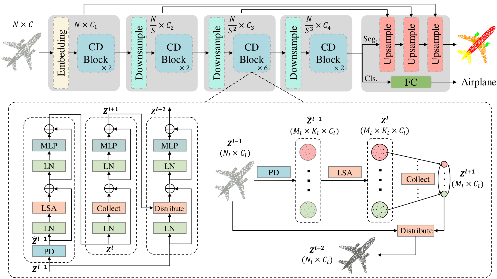
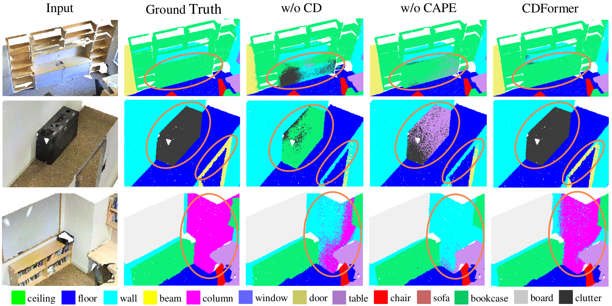
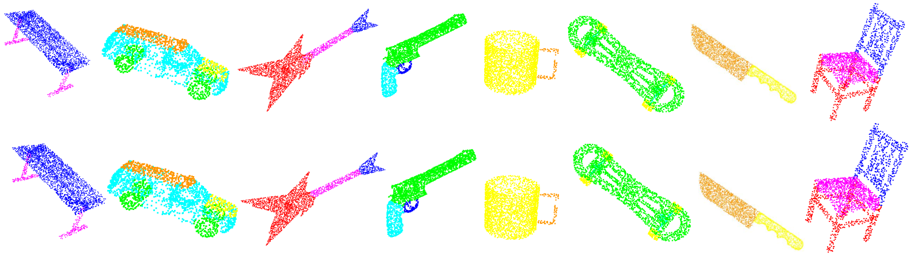

# CDFormer
This is the Pytorch implementation of our following paper:
>**Collect-and-Distribute Transformer for 3D Point Cloud Analysis**
> 
> *Haibo Qiu, Baosheng Yu, and Dacheng Tao*
><details><summary> <b>Abstract</b></summary>
>
>Although remarkable advancements have been made recently in point cloud analysis through the exploration of transformer architecture, it remains challenging to effectively learn local and global structures within point clouds. In this paper, we propose a new transformer architecture equipped with a collect-and-distribute mechanism to communicate short- and long-range contexts of point clouds, which we refer to as CDFormer. Specifically, we first utilize self-attention to capture short-range interactions within each local patch, and the updated local features are then collected into a set of proxy reference points from which we can extract long-range contexts. Afterward, we distribute the learned long-range contexts back to local points via cross-attention. To address the position clues for short- and long-range contexts, we also introduce context-aware position encoding to facilitate position-aware communications between points. We perform experiments on four popular point cloud datasets, namely ModelNet40, ScanObjectNN, S3DIS, and ShapeNetPart, for classification and segmentation. Results show the effectiveness of the proposed CDFormer, delivering several new state-of-the-art performances on point cloud classification and segmentation tasks. The code is available in the supplementary material and will be made publicly available.
></details>



<details><summary> <b>Visualizations</b></summary>



</details>

**Table of Contents**
* [Installation](#installation)
* [Data preparation](#data-preparation)
   * [S3DIS](#s3dis)
   * [ShapeNetPart](#shapenetpart)
   * [ModelNet40](#modelnet40)
   * [ScanObjectNN](#scanobjectnn)
* [Training](#training)
* [Testing](#testing)
* [Acknowledgment](#acknowledgment)
* [Citation](#citation)

## Installation
1. Create a conda env with
   ```bash
   conda env create -f environment.yml
   ```
2. Compile `pointops`:
   Please make sure the `gcc` and `nvcc` can work normally. Then, compile and install pointops2 by:
    ```bash
    cd lib/pointops2
    python setup.py install
    ```
    (Note that we made the successful compilation under `gcc=7.5.0, cuda=11.3` and `gcc=7.4.0, cuda=10.2`)
3. Compile `emd` (optional for classification):
    ```bash
    cd lib/emd
    python setup.py install
    ```

## Data preparation
### S3DIS
Please refer to [Pointnet_Pointnet2_pytorch](https://github.com/yanx27/Pointnet_Pointnet2_pytorch#data-preparation-2) for preprocessing, and put the processed data to `dataset/s3dis/stanford_indoor3d`.

### ShapeNetPart
We follow [PointNext](https://guochengqian.github.io/PointNeXt/examples/shapenetpart/) to uniformly sample 2048 points. You can also use the preprocessed data provided below:
```bash
cd dataset && mkdir dataset/shapenetpart && cd shapenetpart
gdown https://drive.google.com/uc?id=1W3SEE-dY1sxvlECcOwWSDYemwHEUbJIS
tar -xvf shapenetcore_partanno_segmentation_benchmark_v0_normal.tar
```

### ModelNet40
Following [PointNext](https://guochengqian.github.io/PointNeXt/examples/shapenetpart/), ModelNet40 dataset will be downloaded automatically.

### ScanObjectNN
Download from the [official website](https://hkust-vgd.github.io/scanobjectnn/), or use the processed dataset from [PointNext](https://guochengqian.github.io/PointNeXt/examples/scanobjectnn/).
```bash
cd dataset && mkdir scanobjectnn
gdown https://drive.google.com/uc?id=1iM3mhMJ_N0x5pytcP831l3ZFwbLmbwzi
tar -xvf ScanObjectNN.tar --directory=scanobjectnn
```

Finally, the entire dataset folder structure will be like:
```
dataset
 |--- s3dis
        |--- s3dis_names.txt
        |--- stanford_indoor3d
                |--- Area_1_conferenceRoom_1.npy
                |--- Area_1_conferenceRoom_2.npy
                |--- ...
 |--- shapenetpart
        |--- shapenetcore_partanno_segmentation_benchmark_v0_normal
                |--- train_test_split
                      |--- shuffled_train_file_list.json
                      |--- ...
                |--- 02691156
                      |--- 1a04e3eab45ca15dd86060f189eb133.txt
                      |--- ...               
                |--- 02773838
                |--- synsetoffset2category.txt
                |--- processed
                      |--- test_2048_fps.pkl
 |--- modelnet40ply2048 
        |--- modelnet40_ply_hdf5_2048
                |--- ply_data_test0.h5
                |--- ... 
                |--- ply_data_train4.h5
 |--- scanobjectnn 
        |--- h5_files
                |--- main_split
                      |--- training_objectdataset_augmentedrot_scale75.h5
                      |--- test_objectdataset_augmentedrot_scale75.h5
```

## Training
The training commands for S3DIS, ShapeNetPart, ModelNet40, and ScanObjectNN are summarized as follows:
```bash
# S3DIS
./scripts/train_s3dis.sh

# ShapeNetPart
./scripts/train_shapepart.sh

# ModelNet40
./scripts/train_modelnet40.sh 0

# ScanObjectNN
./scripts/train_scanobjnn.sh 0
```

## Testing
Pretrained models for S3DIS, ShapeNetPart, ModelNet40, and ScanObjectNN are available in [google drive](https://drive.google.com/drive/folders/1NmwQOUtnCIOm51fbYnJPlrqTMnEAkyoS?usp=drive_link). Downloading models into `checkpoints/` and running testing scripts under `scripts`. Taking ScanObjectNN as an example, we can:
1. Download [scanobjectnn_cdformer.pth](https://drive.google.com/file/d/1vXVDauy_dDFGZN2t_gNj3flbsv11zTtK/view?usp=drive_link) into `checkpoints/`.
2. Evaluate on ScanObjectNN by simply running:
    ```bash
    # using GPU 0
    ./scripts/test_scanobjnn.sh 0
    ```
Other trained models can be similarly evaluated.
    
## Acknowledgment
This repo is built based on [Stratified Transformer](https://github.com/dvlab-research/Stratified-Transformer), [Point Transformer](https://github.com/POSTECH-CVLab/point-transformer) and [PointNeXt](https://github.com/guochengqian/PointNeXt). Thanks the contributors of these repos!

## Citation
Coming soon
